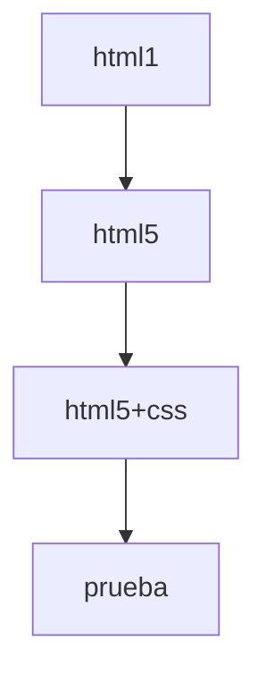

# ejercicios_HTML 

```
    ENTIDAD: Centro de Biotecnologia Agropecuaria
    FICHA: 2558346
    PROGRAMO: Analisis y Desarrollo de Software
    AUTOR: Wilson Mauricio Rodriguez Rodriguez
    objetivo>: uso de las etiquetas HTML: p
    FECHA CREACION:7 de AGOSTO de 2022
    VERSION: 3.0.0
```
## V_1 HTML
>*EN ESTA VERSION SE PUBLICO EJERCICOS XHTML EN DONDE LA VERSION ES DESACTUALIZADA MAS LAS IMAGENES QUE ESTA USA.*

## V_2 HTML
>*ESTA VESION CONTINE LOS ELEMENTOS QUE DAN VISTA A LA WEB EN DONDE SE DIFERENCIA LA ACTUALIZACION A LA VERSION HTML5 MAS LAS IMAGENES QUE ESTA USA.*

## V_3 HTML
>*ESTA VERSION DE HTML5 FUE VINCULADA A ARCHIVOS CSS PARA EL DISEÑO DE LA WEB DONE SE AFECTO LA FAMILIA DE TEXTO, COLOR, MARGENES ESTOS CAMBIOS SON MAS VISIBLES MAS LAS IMAGENES QUE ESTA USA.* 

Aquí hay un diagrama de flujo simple del proceso:


