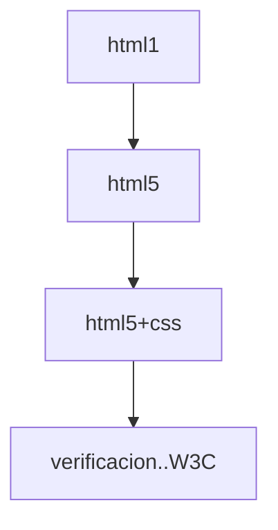

# ejercicios_HTML 

```
    ENTIDAD: Centro de Biotecnologia Agropecuaria
    FICHA: 2558346
    PROGRAMO: Analisis y Desarrollo de Software
    AUTOR: Wilson Mauricio Rodriguez Rodriguez
    objetivo>: uso de las etiquetas HTML
    FECHA CREACION:8 de AGOSTO de 2022
```
## V_1.0.0 HTML
>*EN ESTA VERSION SE PUBLICO EJERCICOS XHTML EN DONDE LA VERSION ES DESACTUALIZADA MAS LAS IMAGENES QUE ESTA USA. CON EL FIN DE PAGINAS WEB EN DONDE EL CODIGO TENGA SINTONIA O CONTENGA EJEMPLOS DEL HTML 1 CON EL USO DE ETIQUETAS HTML, COMO:

- !DOCTYPE
- XMLNS
- VALIDADOR HTML
- TITLE
- P
- STRONG
- EM
- &IT
>Y OTRAS MAS QUE SE VEN EN LOS ARCHIVOS


## V_1.1.0 HTML
>*ESTA VESION CONTINE LOS ELEMENTOS QUE DAN VISTA A LA WEB EN DONDE SE DIFERENCIA LA ACTUALIZACION A LA VERSION HTML5 MAS LAS IMAGENES QUE ESTA USA.*
- :wastebasket: SE ELIMINARON LAS ETIQUETAS U OBJETOS DESACTUALIZADAS O QUE YA NO ERAN FUNCIONALES.
- :heavy_check_mark: SE AÑADIO ETIQUETAS FUNCIONALES DE HTML5.
- :heavy_check_mark: SE VERIFICO EN W3C EXITOSAMENTE PARA HTML5.
- :heavy_check_mark: SE ACORTO EL CODIGO PARA MAYOR RENDIMIENTO.


## V_1.2.0 HTML
>*ESTA VERSION DE HTML5 FUE VINCULADA A ARCHIVOS CSS PARA EL DISEÑO DE LA WEB DONE SE AFECTO LA FAMILIA DE TEXTO, COLOR, MARGENES ESTOS CAMBIOS SON MAS VISIBLES MAS LAS IMAGENES QUE ESTA USA.* 
- :heavy_check_mark: SE VINCULO ARCHIVOS CSS A HTML5.
- :heavy_check_mark: SE DISEÑO CON EL FIN DE MAYOR ENTENDIMIENTO EN LA WEB.
- :heavy_check_mark: SE AÑADIERON IMAGENES.
- :heavy_check_mark: SE VERIFICO EN W3C EXITOSAMENTE PARA CSS

AQUÍ HAY UN DIAGRAMA DE FLUJO SIMPLE DEL PROCESO:


